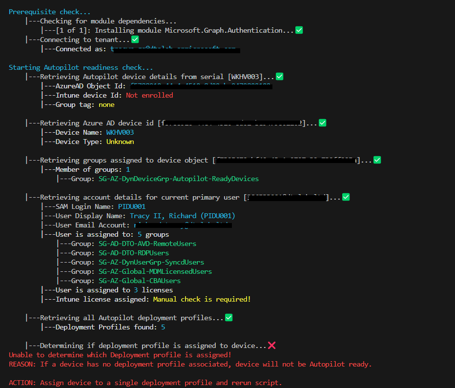

# Autopilot Readiness Pre-Flight Checker

This script is designed to check to ensure a device is Autopilot Ready

This code only uses **get** cmdlets. There are no _sets_

## Required modules:

- Microsoft.Graph.Authentication
- Microsoft.Graph.Users
- Microsoft.Graph.Groups
- Microsoft.Graph.Identity.DirectoryManagement
- Microsoft.Graph.Devices.CorporateManagement
- Microsoft.Graph.DeviceManagement
- Microsoft.Graph.DeviceManagement.Enrolment

> NOTE Script uses beta graphAPI

## Supported

- Powershell 5.1 or higher (Tested with Posh 7.3.5)


## What it checks for

1. Check if device is enrolled as Autopilot Device
2. Check if the device is assigned a deployment profile and how (group tag, Azure AD group)
3. Check if device is assigned an ESP and what are the apps assigned to it
4. Check to see what groups the device is assigned to
5. Check to see if one of those groups are assigned to the apps as required.
6. Check type of deploymentprofile is assigned to device (hybrid vs Azure AD)
7. If Hybrid, check to make sure only one domain join profile is assigned to device


## How to run
Run it against a sreial number
```powershell
.\AutoPilotReadiness.ps1 -Serial 'N4N0CX11Z173170'
```
Run it against a device name
```powershell
.\AutoPilotReadiness.ps1 -DeviceName 'DTOPAW-1Z173170'
```

## What it looks like (exampled)

Test against a potential azure ad device


Test against a potential hybrid device


Test against an existing device


Failed test



## Known issues

- If apps or configuration has assignment filters; this may cause the output to be wrong; this is because the tool doesn't currently check if the device is in a filter.

## Future plans

- WPF UI
- Logging
- support assignment filters
- Check if device is assigned at least one compliance policy (to ensure device will be compliant)
- Check if device is assigned a user profile
- Check if device is part of a device filter
- Check if device is assigned a device category
- Check Device restrictions against device
- Check Device limitation against user profile
- Check if device has supporting OS (using WINRM)
- Check if user is part of CBA Stage Rollout
- Check for Organization branding
- Check if User is assigned a MDM and Windows license
- Check if user is part of "allow user to Azure AD device" join group
- Check if user is part of MDM enrollment group
- Check if device is assigned a post script (eg. rename script, complete script, etc)
            
# DISCLAIMER

THE SOFTWARE IS PROVIDED "AS IS", WITHOUT WARRANTY OF ANY KIND, EXPRESS
OR IMPLIED, INCLUDING BUT NOT LIMITED TO THE WARRANTIES OF MERCHANTABILITY,
FITNESS FOR A PARTICULAR PURPOSE AND NONINFRINGEMENT. IN NO EVENT SHALL THE
AUTHORS OR COPYRIGHT HOLDERS BE LIABLE FOR ANY CLAIM, DAMAGES OR OTHER
LIABILITY, WHETHER IN AN ACTION OF CONTRACT, TORT OR OTHERWISE, ARISING
FROM, OUT OF OR IN CONNECTION WITH THE SOFTWARE OR THE USE OR OTHER
DEALINGS IN THE SOFTWARE.
