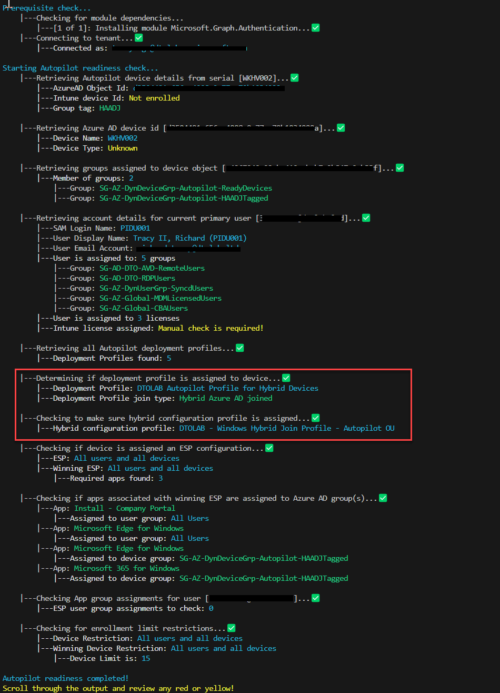
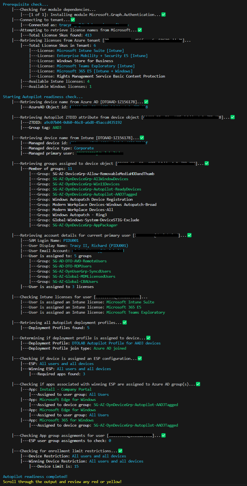

# Autopilot Readiness Pre-Flight Checker

This script is designed to check to ensure a device is Autopilot Ready

This code only uses **get** cmdlets. There are no _sets_

## Required modules:

- Microsoft.Graph.Authentication

> NOTE: This script uses beta graph API requests

## Supported

- Powershell 5.1 or higher (Tested with Posh 7.3.5)

## What does it do?

1. Check if device is enrolled as Autopilot Device
1. Check if the device is assigned a deployment profile and how (group tag, Azure AD group)
1. Check if device is assigned an ESP and what are the apps assigned to it
1. Check to see what groups the device is assigned to
1. Check to see if device groups are assigned to the apps as required.
1. Check to see if user groups are assigned to the apps as required.
1. Check type of DeploymentProfile is assigned to device (hybrid vs Azure AD)
1. If Hybrid, check to make sure only one domain join profile is assigned to device
1. Check if device is assigned a user profile
1. Check if user is assigned to MDM enrollment group and Intune license
1. Check if user is part of "allow user to Azure AD device" join group

> NOTE: All graph calls are read only! 

## Graph scoped permissions

Permission Scope | Graph Resource Endpoint | Link
--|--|--
Device.Read.All | /devices | https://learn.microsoft.com/en-us/graph/permissions-reference#device-permissions
Directory.Read.All | <li>/subscribedSkus</li><li>/groups</li>  | https://learn.microsoft.com/en-us/graph/permissions-reference#directory-permissions
GroupMember.Read.All | /groups | https://learn.microsoft.com/en-us/graph/permissions-reference#group-permissions
Group.Read.All | /groups | https://learn.microsoft.com/en-us/graph/permissions-reference#group-permissions
User.Read.All | /users | https://learn.microsoft.com/en-us/graph/permissions-reference#user-permissions
DeviceManagementApps.Read.All | <li>/deviceAppManagement/mobileApps</li> | https://learn.microsoft.com/en-us/graph/permissions-reference#intune-device-management-permissions
DeviceManagementConfiguration.Read.All |<li>/users</li><li>/deviceManagement/managedDevices</li><li>/deviceManagement/deviceConfigurations</li><li>/deviceManagement/deviceEnrollmentConfigurations</li>|https://learn.microsoft.com/en-us/graph/permissions-reference#intune-device-management-permissions
DeviceManagementManagedDevices.Read.All |<li>/users</li><li>/deviceManagement/managedDevices</li>|https://learn.microsoft.com/en-us/graph/permissions-reference#intune-device-management-permissions
DeviceManagementServiceConfig.Read.All |<li>/users</li><li>/deviceManagement/windowsAutopilotDeviceIdentities</li><li>/deviceManagement/windowsAutopilotDeploymentProfiles</li><li>/deviceManagement/deviceEnrollmentConfigurations</li> | https://learn.microsoft.com/en-us/graph/permissions-reference#intune-device-management-permissions
Organization.Read.All | /subscribedSkus | https://learn.microsoft.com/en-us/graph/permissions-reference#organization-permissions
Policy.Read.All | <li>/policies/deviceRegistrationPolicy</li><li>/policies/mobileDeviceManagementPolicies</li><li>/policies/conditionalAccessPolicies</li>| https://learn.microsoft.com/en-us/graph/permissions-reference#policy-permissions

## How to run
Run it against a serial number
```powershell
.\AutoPilotReadiness.ps1 -Serial 'N4N0CX11Z173170'
```
Run it against a device name
```powershell
.\AutoPilotReadiness.ps1 -DeviceName 'DTOPAW-1Z173170'
```

Run it against a device name and check licenses if primary user is assigned
```powershell
.\AutoPilotReadiness.ps1 -DeviceName 'DTOAAD-1Z156178' -CheckUserLicense

```
Run it against a serial and check licenses for enrolling user
```powershell
.\AutoPilotReadiness.ps1 -Serial 'N4N0CX11Z173170' -UserPrincipalName 'tracyr@contoso.com' -CheckUserLicense
```

Run it against a serial, check licenses for enrolling user, and check Azure settings
```powershell
.\AutoPilotReadiness.ps1 -Serial 'N4N0CX11Z173170' -UserPrincipalName 'tracyr@contoso.com' -CheckUserLicense -CheckAzureAdvSettings
```


## What it looks like (example)

Test against a potential azure ad device


Test against a potential hybrid device



Test against an existing device



Failed test


## Known issues

- If apps or configuration has assignment filters; this may cause the output to be wrong; this is because the tool doesn't currently check if the device is in a filter.

## Future plans

- WPF UI
- Make it modular (Json controlled)
- Logging (cmtrace format)
- Support assignment filters
- Check if device is assigned at least one compliance policy (to ensure device will be compliant)
- Check if device is part of a device filter
- Check if device is assigned a device category
- Check Device restrictions against device
- Check Device limitation against user profile
- Check if device has supporting OS (using WINRM)
- Check if user is part of CBA Stage Rollout
- Check for Organization branding
- Check if user is assigned a Windows license.
- Check if device is assigned a post script (eg. rename script, complete script, etc)
            
# DISCLAIMER

THE SOFTWARE IS PROVIDED "AS IS", WITHOUT WARRANTY OF ANY KIND, EXPRESS
OR IMPLIED, INCLUDING BUT NOT LIMITED TO THE WARRANTIES OF MERCHANTABILITY,
FITNESS FOR A PARTICULAR PURPOSE AND NONINFRINGEMENT. IN NO EVENT SHALL THE
AUTHORS OR COPYRIGHT HOLDERS BE LIABLE FOR ANY CLAIM, DAMAGES OR OTHER
LIABILITY, WHETHER IN AN ACTION OF CONTRACT, TORT OR OTHERWISE, ARISING
FROM, OUT OF OR IN CONNECTION WITH THE SOFTWARE OR THE USE OR OTHER
DEALINGS IN THE SOFTWARE.
